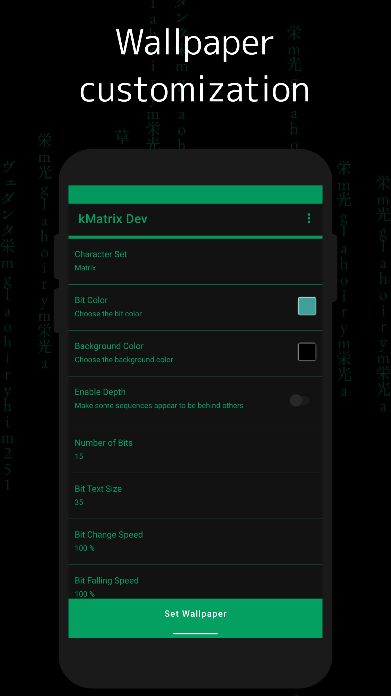
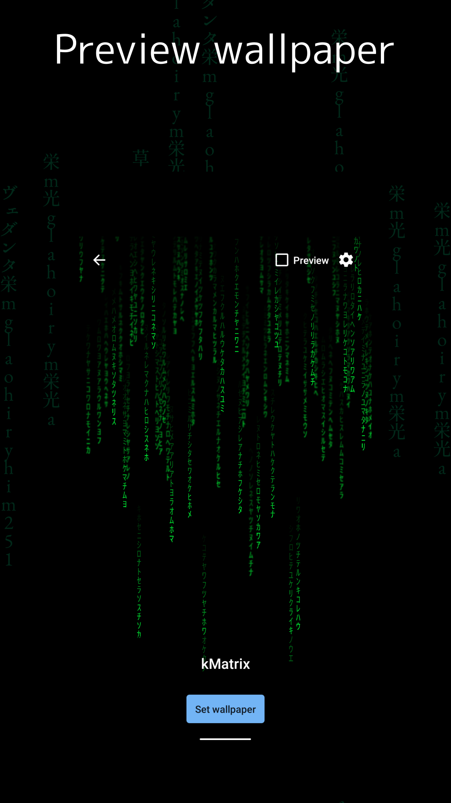
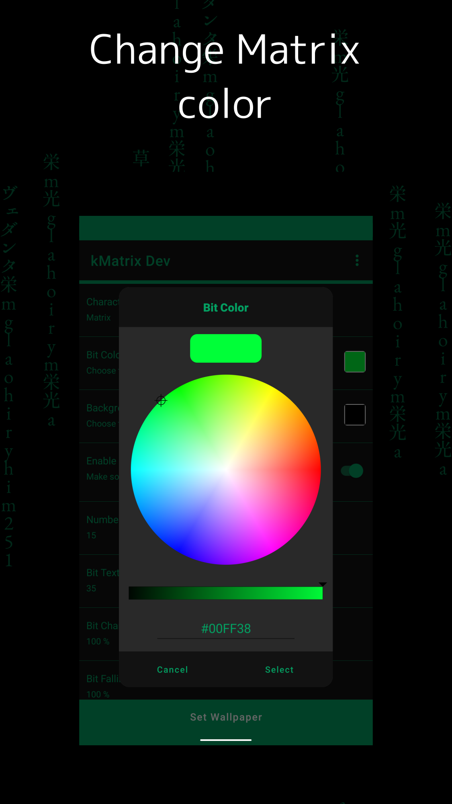

# kMatrix

A live wallpaper app with Matrix and Hacker live wallpapers with customizations.

-------------------------------------------------
kMatrix – Features
-------------------------------------------------

Features :

- Preview and set Matrix live wallpaper
- Preview and set Hacker (Binary) live wallpaper
- Preview and set custom text live wallpaper
- Customize Character Set
- Customize Characters Color
- Customize Background Color
- Customize Character Text Size
- Customize Falling Speed
- Customize Direction

kMatrix is available on the Google Play Store.  

We hope this app serves you well.

kMatrix is a fork of [Hacker Live Wallpaper](https://github.com/gsingh93/hacker-live-wallpaper).

kMatrix is developed by Arupakaman Studios.
Arupakaman Studios is a group of independent developers working on various applications and services.

You can send us your feedback and app suggestions via email.

## Contact Us

Contact us at: arupakamanstudios[AT]gmail[DOT]com

## Licensing

kMatrix is licensed under the [MIT License.](LICENSE)